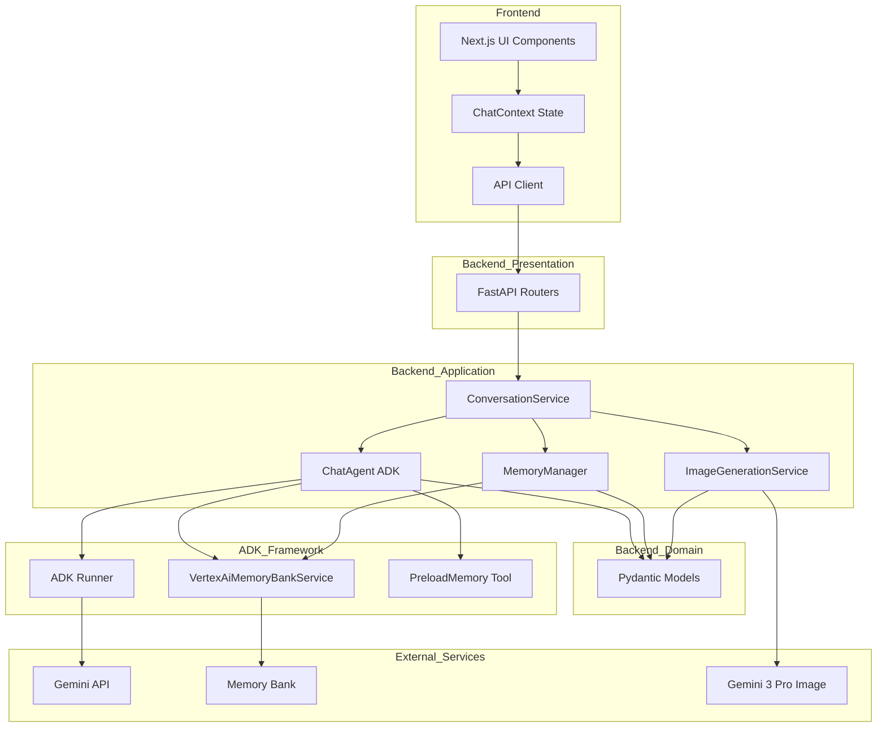
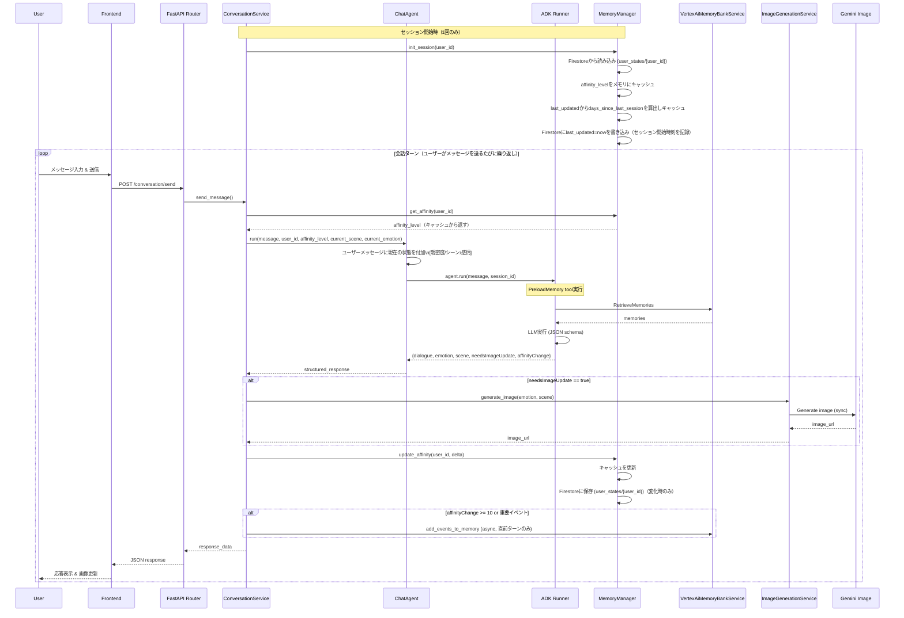
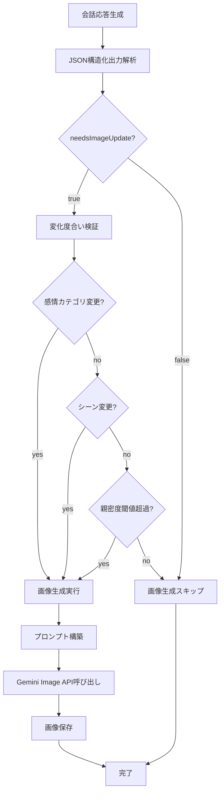
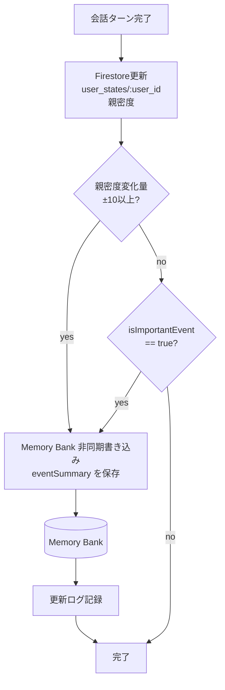

# 技術設計書

## 概要

本機能は、Vertex AI Agent Engineを活用したステートフル対話アプリケーションを提供します。Memory Bank(長期記憶)とSessions(短期記憶)を組み合わせた二層記憶管理により、ユーザーとの関係性を記憶し、感情・シーンに応じた画像を動的生成する対話体験を実現します。

**目的**: Google Cloud関連登壇での技術デモンストレーションを通じて、Agent Engineの記憶機構の実践的活用方法とLLMと画像生成を統合した対話アプリの設計パターンを示す

**ユーザー**: デモ参加者(技術者・エンジニア)が、実際に動作するアプリケーションを通じてAgent Engineの技術要素を体験・理解できる

**影響**: 既存システムの変更はなし(新規実装)

### ゴール

- Agent EngineのMemory BankとSessionsを活用した二層記憶管理の実装
- LLMからの構造化出力(JSON)によるメタデータ抽出パターンの実証
- 感情・シーン変化に応じた画像生成トリガーの実装
- 15分デモで技術的価値を明確に伝えられる動作するアプリケーション

### 非ゴール

- 本番環境レベルのパフォーマンス最適化(画像キャッシュ、非同期処理)
- 包括的なエラーリトライロジック(基本的なログ出力のみ)
- 複雑なUI/UXデザイン(機能を示せる最小限のUI)
- マルチユーザー対応(デモは単一ユーザー想定)
- リアルタイム通知(WebSocket/SSE不要)

## アーキテクチャ

### アーキテクチャパターン & システム境界

**選定パターン**: Service-Oriented Architecture with Clean Architecture principles

**アーキテクチャ統合**:
- 選定理由: FastAPIの依存性注入システムと親和性が高く、テスタビリティと保守性を両立
- ドメイン/機能境界:
  - Presentation層(API Routers): 入力検証とルーティングのみ
  - Application層(Services): ビジネスロジックと外部API連携
  - Domain層(Models): データ構造定義
  - Infrastructure層: 設定管理、認証
- 既存パターンの維持: ステアリング文書で定義されたService-Oriented設計原則に準拠
- 新コンポーネント追加理由:
  - ChatAgent: ADKエージェント定義、Memory Bank自動統合
  - MemoryManager: 親密度管理とMemory Bank操作のラッパー
  - ImageGenerationService: 画像生成ロジックとAPI連携を分離
- ステアリング準拠: `structure.md`で定義されたサービス層分離原則、`tech.md`の依存性注入パターンを適用



**アーキテクチャの主要な設計決定**:
- ADK統合によりSession/Memory Bank管理を大幅に簡素化、手動API呼び出し不要
- PreloadMemory toolによる自動メモリ取得、会話ごとに関連記憶を自動ロード
- 依存性注入により、テスト時にモックサービスへの置き換えが容易
- 同期的な画像生成フローにより、ジョブキューやステータス追跡の複雑性を排除
- React Context APIによるフロントエンド状態管理で、外部ライブラリへの依存を最小化

### テクノロジースタック

| Layer | Choice / Version | Role in Feature | Notes |
|-------|------------------|-----------------|-------|
| Frontend / CLI | Next.js 14+ (TypeScript 5+) | UI/UX、状態管理 | App Router、React Context API使用 |
| Frontend / CLI | Tailwind CSS | スタイリング | ユーティリティファーストCSS |
| Frontend / CLI | shadcn/ui | UIコンポーネント | Tailwindベース、カスタムCSS最小化、デモ安定性優先 |
| Backend / Services | FastAPI 0.104+ (Python 3.11+) | APIエンドポイント、依存性注入 | 非同期処理サポート |
| Backend / Services | ADK (Agent Development Kit) | Agent Engine統合フレームワーク | VertexAiMemoryBankService、PreloadMemory、ADK Runner |
| Backend / Services | google-generativeai | Gemini API統合 | 構造化出力、画像生成 |
| Backend / Services | Pydantic | データ検証、型安全性 | JSON schema生成 |
| Data / Storage | File-based JSON | ローカルデータ管理 | `data/characters/`（設定）, `data/images/`（生成画像） |
| Data / Storage | Cloud Firestore | 親密度状態の永続化 | コレクション: `user_states`、ドキュメントID: `{user_id}` |
| Infrastructure / Runtime | Google Cloud Vertex AI | AI Platform | Agent Engine、Gemini 3 Pro Image |
| Infrastructure / Runtime | Service Account (JSON) | 認証 | GOOGLE_APPLICATION_CREDENTIALS |

**主要な技術選定の理由**:
- **ADK (Agent Development Kit)**: Code-firstフレームワークでMemory Bank/Sessionsの統合が大幅に簡素化。VertexAiMemoryBankServiceとPreloadMemoryツールにより、手動API呼び出し不要(要件3、4に直接対応)
- **Gemini 3 Pro Image**: Imagen 3による高品質な画像生成、System instructionsでキャラクター外見の一貫性維持(要件1、7に対応)
- **FastAPI**: 依存性注入機能によるサービス層の疎結合化、ADKとの統合が容易、自動OpenAPIドキュメント生成
- **Pydantic**: JSON schema自動生成によるGemini構造化出力との親和性(要件6に対応)
- **React Context API**: 外部依存なしでの状態管理、デモスコープに十分な機能性
- **shadcn/ui**: TailwindベースのUIコンポーネントライブラリ。Card、Button、Input、ScrollArea、Spinnerなどのプリミティブを組み合わせることでカスタムCSSを最小化し、デモの安定性を優先(要件9に対応)
- **Cloud Firestore**: 親密度状態をFirestoreで管理。読み書きが10ms以下と高速で頻繁な更新に適しており、「状態=Firestore、記憶=Memory Bank、会話=Sessions」という三層管理をデモで明確に示せる(要件5.3に対応)

**外部依存の詳細**(`research.md`参照):
- ADK: 最新版2026年1月22日リリース、隔週リリースサイクル、gcloud auth ADC認証
- Gemini 3 Pro Image: $0.134/画像(1K-2K)、デモ想定コスト$4-5(20-30画像)
- Memory Bank: 2026年1月28日から課金開始、閾値ベース更新で最適化
- Sessions: ADK Runnerが自動管理、30分非アクティブでタイムアウト

## システムフロー

### 会話フロー



**フロー設計の主要決定**:
- ADK Runner + VertexAiSessionService によるSession管理: `session_service.create_session()` で明示的にセッションを作成し、`session_id` を Runner に渡す（AdkApp とは異なり、Runner では Session の明示的な管理が必要）
- PreloadMemory tool: 毎ターン自動でMemory Bank検索、手動API呼び出し不要
- 同期的画像生成(ブロッキング): UXは劣るが実装が大幅に簡素化(デモスコープに適切)
- 閾値ベースMemory Bank更新: 親密度±10で自動保存、APIコール削減

### 画像生成トリガー判定フロー



**判定ロジックの主要決定**:
- LLMは構造化JSON内の`needsImageUpdate`フラグを返す（提案のみ、最終決定はしない）
- ConversationServiceがそのフラグを読み取り、プログラム的なルール（感情カテゴリ変更・シーン変更・親密度閾値超過）と照合して最終判定する（LLMの提案 AND プログラムの検証、両方が真の場合のみ生成）
- 親密度閾値: ±10ポイント変化で画像更新トリガー(コストと体験のバランス)

### Memory Bank更新フロー



**Memory Bank更新の主要決定**:
- 親密度はFirestoreに毎ターン更新（低レイテンシ・クラウド永続化）
- Memory Bankは重要イベント時のみ更新（APIコスト削減）
- Memory Bank書き込みトリガーは2種類（OR条件）: ①親密度±10以上（バックエンドがプログラム的に検知）、②isImportantEvent=true（LLMが直接判定、バックエンドはそのまま信頼）
- ※ needsImageUpdateとは異なり、isImportantEventはLLMの判断をそのまま使用する（バックエンドによる追加検証なし）
- Memory Bankに保存する内容はLLMが生成した `eventSummary` をそのまま使用（別途パース不要）
- 非同期処理により会話フローへの影響を最小化


## 要件トレーサビリティ

| 要件 | 概要 | コンポーネント | インターフェース | フロー |
|------|------|--------------|-----------------|--------|
| 1.1 | デフォルト画像表示 | CharacterImageDisplay | Props: imageUrl | - |
| 1.2 | 感情・シーン変化判定 | ConversationService, ChatAgent | agent.run() | 会話フロー |
| 1.3 | 大きな変化時の画像生成 | ImageGenerationService | generate_image() | 画像生成トリガー判定フロー |
| 1.4 | 小さな変化時の画像維持 | ConversationService | Logic in send_message() | 画像生成トリガー判定フロー |
| 1.5 | 画像生成中のローディング表示 | CharacterImageDisplay | Props: isGenerating | - |
| 1.6 | 生成完了時の画像更新 | CharacterImageDisplay | Props: imageUrl | - |
| 1.7 | 画像生成エラー時のフォールバック | ImageGenerationService | Error handling in generate_image() | 会話フロー |
| 2.1 | メッセージ送信 | MessageInput, ChatContext | sendMessage() | 会話フロー |
| 2.2 | 応答の会話ログ追加 | ConversationLog, ChatContext | State update | 会話フロー |
| 2.3 | 応答生成中のローディング状態 | MessageInput, ChatContext | isLoading state | 会話フロー |
| 2.4 | 空メッセージの送信拒否 | MessageInput | Form validation | - |
| 2.5 | 最新メッセージへの自動スクロール | ConversationLog | useEffect with scrollIntoView | - |
| 3.1 | メッセージのSessions記録 | ADK Runner | Auto session management | 会話フロー |
| 3.2 | 会話文脈のSessions取得 | ADK Runner | Auto session management | 会話フロー |
| 3.3 | Session終了と新規Session開始 | ADK Runner | Auto session timeout | - |
| 3.4 | タイムスタンプ付き保存 | ADK Runner | SessionEvent auto-timestamp | 会話フロー |
| 4.1 | 重要情報のMemory Bank記録 | MemoryManager | add_session_to_memory() | Memory Bank更新フロー |
| 4.2 | 新Session開始時のMemory Bank取得 | ChatAgent (PreloadMemory tool) | Auto memory retrieval | 会話フロー |
| 4.3 | 過去の出来事検索 | ChatAgent (LoadMemoryTool) | LLMが能動的にMemory Bank検索 | 会話フロー |
| 4.4 | カテゴリ付きMemory Bank保存 | MemoryManager | Memory with category field | Memory Bank更新フロー |
| 5.1 | 親密度初期化 | MemoryManager | get_affinity() | - |
| 5.2 | 会話内容に基づく親密度増減 | ConversationService | calculate_affinity_change() | 会話フロー |
| 5.3 | 親密度変化のMemory Bank記録 | MemoryManager | update_affinity() | Memory Bank更新フロー |
| 5.4 | 親密度レベルに応じた応答トーン | ChatAgent | System instructions with affinity context | 会話フロー |
| 5.5 | 親密度計算ロジック | ConversationService | Logic in send_message() | 会話フロー |
| 6.1 | 構造化JSON出力要求 | ChatAgent | response_schema in Agent config | 会話フロー |
| 6.2 | JSONパース失敗時のデフォルト値 | ChatAgent | Error handling in run() | 会話フロー |
| 7.1 | 画像生成プロンプト構築 | ImageGenerationService | build_prompt() | 画像生成トリガー判定フロー |
| 7.2 | Gemini Image API形式での出力 | ImageGenerationService | generate_image() | 画像生成トリガー判定フロー |
| 7.3 | 生成画像の保存 | ImageGenerationService | save_image() | 画像生成トリガー判定フロー |
| 8.1 | Agent Engine接続失敗時のエラー表示 | API Router | HTTPException handling | - |
| 8.2 | 画像生成失敗時の前回画像維持 | ConversationService | Fallback logic | 会話フロー |
| 8.3 | エラーログ記録 | All Services | Python logging | - |
| 9.1 | UI要素表示 | ChatPage | Component composition | - |
| 9.2 | Enterキー送信 | MessageInput | Form onSubmit | - |
| 9.3 | 最新メッセージスクロール | ConversationLog | useEffect | - |
| 9.4 | ローディング表示 | CharacterImageDisplay, MessageInput | isLoading/isGenerating props | - |

## コンポーネントとインターフェース

### コンポーネント概要

| コンポーネント | ドメイン/層 | 意図 | 要件カバレッジ | 主要依存関係(優先度) | コントラクト |
|--------------|------------|------|--------------|---------------------|-------------|
| ConversationService | Application/Backend | 会話フロー全体の調整 | 1.2, 1.4, 2.1, 5.2, 5.5, 8.2 | ChatAgent(P0), ImageGenerationService(P1) | Service |
| ChatAgent | Application/Backend | ADKエージェント定義 | 2.2, 3.1, 3.2, 4.2, 4.3, 5.4, 6.1, 6.2 | VertexAiMemoryBankService(P0), ADK Runner(P0) | Agent, Service |
| MemoryManager | Application/Backend | Memory Bank操作ラッパー | 4.1, 4.4, 5.1, 5.3 | VertexAiMemoryBankService(P0) | Service |
| ImageGenerationService | Application/Backend | 画像生成とプロンプト構築 | 1.3, 1.7, 7.1, 7.2, 7.3 | google-generativeai(P0) | Service, API |
| ChatContext | Frontend | 会話状態管理 | 2.1, 2.2, 2.3 | API Client(P0) | State |
| CharacterImageDisplay | Frontend | 画像表示とローディング | 1.1, 1.5, 1.6, 9.4 | ChatContext(P0) | - |
| ConversationLog | Frontend | 会話履歴表示 | 2.2, 2.5, 9.3 | ChatContext(P0) | - |
| MessageInput | Frontend | メッセージ入力フォーム | 2.1, 2.3, 2.4, 9.2, 9.4 | ChatContext(P0) | - |

### Application Layer / Backend Services

#### ConversationService

| フィールド | 詳細 |
|----------|------|
| Intent | 会話フロー全体のオーケストレーション(メッセージ受信 → 応答生成 → 画像更新判定 → Memory Bank更新) |
| Requirements | 1.2, 1.4, 2.1, 5.2, 5.5, 8.2 |

**責務と制約**
- 会話ターンの統合管理(Agent Engine応答 → 画像生成判定 → Memory Bank更新)
- トランザクション境界: 1会話ターン単位(メッセージ受信から応答返却まで)
- データ所有権: 会話フロー状態の一時的管理、永続データは他サービスに委譲

**依存関係**
- Inbound: API Router (POST /conversation/send) — ユーザーメッセージ受信 (P0)
- Outbound: ChatAgent — LLM応答生成とMemory Bank連携 (P0)
- Outbound: ImageGenerationService — 画像生成 (P1)

**コントラクト**: Service [x]

##### APIデータコントラクト

```python
class ConversationRequest(BaseModel):
    user_id: str
    message: str
    session_id: Optional[str] = None

class ConversationResponse(BaseModel):
    session_id: str
    dialogue: str
    narration: str
    emotion: str  # happy|sad|neutral|surprised|thoughtful
    scene: str    # indoor|outdoor|cafe|park
    image_url: Optional[str] = None
    affinity_level: int
    timestamp: str
```

**実装ノート**
- 統合: ChatAgent(ADK)経由でLLM呼び出しとMemory Bank連携、ImageGenerationService経由で画像生成
- 検証: user_id存在確認、message非空チェック、親密度範囲チェック(0-100)
- リスク: 画像生成失敗時は前回画像を維持(要件8.2)、Memory Bank更新はADKが自動管理

#### ChatAgent

| フィールド | 詳細 |
|----------|------|
| Intent | ADKエージェント定義、構造化JSON出力の取得、Memory Bank連携(PreloadMemory + LoadMemory) |
| Requirements | 2.2, 3.1, 3.2, 4.2, 4.3, 5.4, 6.1, 6.2 |

**責務と制約**
- ADKエージェントの定義とツール設定
- JSON schema定義とPydanticモデルへの変換
- Memory Bank記憶取得(PreloadMemoryTool: 毎ターン自動、LoadMemoryTool: LLMが能動的に検索)
- Session管理はADK Runnerに委譲
- トランザクション境界: 1エージェント実行単位
- データ所有権: エージェント状態の管理

**依存関係**
- Inbound: ConversationService — エージェント実行要求 (P0)
- Outbound: VertexAiMemoryBankService — Memory Bank連携 (P0)
- External: ADK Runner — エージェント実行とSession管理 (P0)
- External: Gemini API — LLM応答生成 (P0)

外部依存の詳細(`research.md`参照):
- ADK: google-adk, 2026年1月22日リリース、隔週更新
- 認証: gcloud auth application-default login (ADC)
- Memory Bank: PreloadMemoryTool で毎ターン自動取得 + LoadMemoryTool でLLMが能動的に検索。保存は ConversationService が重要イベント発生時のみ実行（after_agent_callback では保存しない）
- 構造化出力: response_mime_type="application/json" + response_schema必須

**コントラクト**: Agent [x] / Service [x]

##### ADK統合パターン (重要)

LLMからの構造化出力スキーマ:

```python
class StructuredResponse(BaseModel):
    dialogue: str
    narration: str
    emotion: str             # happy|sad|neutral|surprised|thoughtful
    scene: str               # indoor|outdoor|cafe|park
    needsImageUpdate: bool   # 画像更新ヒント（LLMが提案 → バックエンドが感情/シーン/親密度を追加検証して最終判定）
    affinityChange: int      # 親密度変化量（バックエンドが±10閾値でプログラム的に判定）
    isImportantEvent: bool   # 重要な出来事か（LLMが直接判定 → バックエンドはそのまま信頼して保存）
    eventSummary: str        # Memory Bankに保存する内容（isImportantEvent=trueの場合にLLMが生成）
```

Memory Bank 保存方針: **重要イベント発生時のみ ConversationService が明示的に保存**する。コールバックでは保存しない。

理由:
- `after_agent_callback` は毎ターン発火するため、全ターンで保存すると不要な API コストが発生する
- 「重要かどうか」の判定は構造化出力（`affinityChange` 等）を必要とするため、JSON をパース済みの ConversationService が担うべき
- Sessions がすでに短期記憶を管理しているため、全ターンを Memory Bank に入れる必要はない

```python
async def _generate_memories_callback(callback_context: CallbackContext) -> None:
    # Memory Bank 保存は ConversationService に委譲するため、ここでは何もしない
    return None
```

Memory Bank 保存は ConversationService.send_message() 内で判定・実行する（Memory Bank更新フロー参照）。

ADKエージェント初期化 (各サービスの接続と structured output の設定):

```python
self.agent = adk.Agent(
    model="gemini-3.1-pro-preview",
    instruction=self._build_system_instructions(),    # 固定：キャラ設定・各フィールドの意味のみ（JSON形式の説明は不要）
    tools=[PreloadMemoryTool(), LoadMemoryTool()],     # PreloadMemory: 毎ターン自動ロード、LoadMemory: LLMが必要時に能動的検索
    after_agent_callback=_generate_memories_callback,  # 何もしない（保存判定はConversationServiceが担う）
    generate_content_config=types.GenerateContentConfig(  # generation_config ではなく generate_content_config
        response_mime_type="application/json",
        response_schema=StructuredResponse.model_json_schema()  # Pydanticモデルはdict変換が必要
    )
)
# 注意: response_schema をシステムプロンプトに重複記述すると品質低下の原因となる（公式ドキュメント）
```

**動的状態の注入パターン（重要）**:

システムプロンプトは固定。親密度・シーン・感情は会話中に変化するため、**毎ターンのユーザーメッセージに付加**して渡す:

```python
def _build_context_message(self, user_message: str, affinity_level: int, scene: str, emotion: str, days_since: Optional[int] = None) -> str:
    time_context = ""
    if days_since is not None and days_since >= 1:
        time_context = f"\n前回のやりとりから{days_since}日経過"
    return f"""[現在の状態]
親密度: {affinity_level} / シーン: {scene} / 感情: {emotion}{time_context}

[ユーザーメッセージ]
{user_message}"""
```

| 何に書く | 内容 | タイミング |
|---------|------|---------|
| システムプロンプト | キャラ設定・応答ルール・JSONフォーマット | 固定（変更なし） |
| ユーザーメッセージ | 現在の親密度・シーン・感情 | 毎ターン付加 |
| ADK Sessions | 会話履歴 | 自動管理 |

**実装ノート**
- 統合: VertexAiMemoryBankService + PreloadMemoryTool(自動) + LoadMemoryTool(能動的検索)でMemory Bank連携、ADK Runnerが自動Session管理
- 動的状態: システムプロンプトに動的値を含めない。毎ターンのメッセージに現在の状態を付加する
- 検証: JSON schema complexity check(5-7 fields max)、enum値の妥当性確認
- リスク: JSON parse失敗時はデフォルト値使用(要件6.2)、API障害時はADK Runnerが自動リトライ
- Callback: `after_agent_callback` はターンごとに発火（セッション終了時ではない）。Memory Bank 保存の責務は持たせず `return None` のみ。保存判定は ConversationService が構造化出力（affinityChange 等）を見て行う

#### MemoryManager

| フィールド | 詳細 |
|----------|------|
| Intent | 親密度のFirestore管理と、重要な会話イベントのMemory Bank書き込みを担当 |
| Requirements | 4.1, 4.3, 4.4, 5.1, 5.3 |

**責務と制約**
- 親密度をFirestore（コレクション: `user_states`、ドキュメントID: `{user_id}`）で管理
- シーン・感情はセッション開始時にランダム生成（保存なし）
- 重要な会話イベントのテキスト（eventSummary）をMemory Bankへ書き込み
- トランザクション境界: 1 Memory操作単位
- データ所有権: 親密度ファイルとMemory Bank書き込みロジック

**依存関係**
- Inbound: ConversationService — 親密度管理・Memory Bank書き込み要求 (P1)
- Outbound: Cloud Firestore — 親密度状態（user_states コレクション）の読み書き (P0)
- Outbound: VertexAiMemoryBankService — 重要イベントの書き込み (P1)

外部依存の詳細(`research.md`参照):
- VertexAiMemoryBankService: ADKが提供するMemory Bankラッパー（書き込みのみ。検索はChatAgentのLoadMemoryToolが担当）
- スコープ: user ID単位で隔離
- 課金: 2026/1/28から課金開始、重要イベント時のみ書き込みで最適化

**コントラクト**: Service [x]

**実装ノート**
- 統合: 親密度はFirestore（google-cloud-firestore SDK、読み書き < 10ms）、重要イベントのみMemory Bank（APIコスト抑制）
- セッション開始時: 親密度と `last_updated` をFirestoreから読み込み、`days_since_last_session` を算出してキャッシュ後、`last_updated = now` をFirestoreに書き込む（セッション終了の検知が困難なためHTTPステートレスAPIの制約から開始時に記録）。シーン・感情はランダム生成（scene: 4種からランダム、emotion: neutral固定またはランダム）
- 検証: 親密度範囲チェック(0-100)
- リスク: Firestoreアクセス失敗時はデフォルト値（affinity=0）を使用、会話継続を優先
- 設計判断: Memory Bankは自然言語の意味的記憶（好み、出来事）に限定し、本来の用途に沿った設計とする

#### ImageGenerationService

| フィールド | 詳細 |
|----------|------|
| Intent | Gemini 3 Pro Imageとの連携、プロンプト構築、画像生成と保存 |
| Requirements | 1.3, 1.7, 7.1, 7.2, 7.3 |

**責務と制約**
- 画像生成プロンプトの構築(キャラクター外見 + 感情 + シーン)
- Gemini 3 Pro Image APIの呼び出し(同期)
- 生成画像のローカル保存
- トランザクション境界: 1画像生成単位
- データ所有権: 画像ファイルの管理

**依存関係**
- Inbound: ConversationService — 画像生成要求 (P1)
- External: Vertex AI Gemini 3 Pro Image API — 画像生成 (P0)

外部依存の詳細(`research.md`参照):
- Model ID: gemini-3-pro-image-preview
- 価格: $0.134/画像(1K-2K)、デモ想定コスト$4-5(20-30画像)
- 生成時間: 5-15秒
- 対応機能: System instructions(キャラクター外見一貫性)、Thinking mode
- 非対応: Function calling、Context caching

**コントラクト**: Service [x] / API [x]

##### Service Interface

```python
from typing import Optional
from pydantic import BaseModel

class ImageGenerationRequest(BaseModel):
    emotion: str
    scene: str
    affinity_level: int

class ImageGenerationService:
    def __init__(self, project_id: str, location: str, character_config: Dict[str, Any]):
        self.project_id = project_id
        self.location = location
        self.character_config = character_config  # data/characters/character.json から読み込み
        # character_config["appearance_prompt"] を毎回の画像生成プロンプトのベースに使用

    async def generate_image(
        self,
        request: ImageGenerationRequest
    ) -> str:
        """
        画像を生成し、URLを返す

        Preconditions:
        - emotion が有効な感情カテゴリ
        - scene が有効なシーン

        Postconditions:
        - 画像URLが返却される
        - 画像がローカルに保存される

        Invariants:
        - キャラクター外見は一貫性を持つ
        """
        pass

    def build_prompt(
        self,
        emotion: str,
        scene: str,
        affinity_level: int
    ) -> str:
        """
        画像生成プロンプトを構築

        Preconditions:
        - emotion, scene が有効な値

        Postconditions:
        - Gemini Image API用のプロンプトが返却される

        Invariants:
        - プロンプトはキャラクター設定を含む
        """
        pass
```

##### API Contract

| Method | Endpoint | Request | Response | Errors |
|--------|----------|---------|----------|--------|
| POST | Vertex AI generate_images | {prompt, system_instructions} | {image_data} | 400 (Invalid prompt), 429 (Rate limit), 500 (API error) |

**実装ノート**
- 統合: System instructionsでキャラクター外見定義、感情とシーンをプロンプトに埋め込み
- 検証: emotion/scene enum検証、プロンプト長制限チェック(max 65K tokens)
- リスク: 生成失敗時は前回画像を維持(要件1.7、8.2)、1回リトライ後にエラーログ記録

### Presentation Layer / Backend API

#### ConversationRouter

| フィールド | 詳細 |
|----------|------|
| Intent | 会話APIエンドポイントの提供、入力検証とルーティング |
| Requirements | 2.1, 8.1 |

**責務と制約**
- HTTPリクエストの受信と検証
- ConversationServiceへの委譲
- HTTPレスポンスの生成
- 薄いコントローラー層(ビジネスロジックなし)

**依存関係**
- Inbound: Frontend API Client — HTTP POST (P0)
- Outbound: ConversationService — ビジネスロジック実行 (P0)

**コントラクト**: API [x]

##### API Contract

| Method | Endpoint | Request | Response | Errors |
|--------|----------|---------|----------|--------|
| POST | /api/conversation/send | ConversationRequest | ConversationResponse | 400 (Invalid input), 500 (Service error), 503 (Agent Engine unavailable) |
| GET | /api/conversation/history | {session_id, limit} | List[Message] | 404 (Session not found), 500 (Service error) |

**実装ノート**
- 統合: FastAPI依存性注入でConversationService取得、Pydantic自動検証
- 検証: user_id非空、message最大長チェック(2000文字)
- リスク: Agent Engine障害時はHTTPException 503、エラー詳細はログ記録

### Frontend Layer / React Components

#### ChatContext

| フィールド | 詳細 |
|----------|------|
| Intent | 会話状態の集中管理、API Client統合 |
| Requirements | 2.1, 2.2, 2.3 |

**責務と制約**
- 会話メッセージのリスト管理
- ローディング状態の管理
- 現在の画像URLの管理
- React Context APIによる状態配信

**依存関係**
- Inbound: UI Components — 状態参照と更新 (P0)
- Outbound: API Client — バックエンド通信 (P0)

**コントラクト**: State [x]

##### 状態型定義

```typescript
interface Message {
  role: 'user' | 'agent';
  dialogue: string;
  narration?: string;
  timestamp: string;
}

interface ChatState {
  messages: Message[];
  currentImageUrl: string;
  isLoading: boolean;
  isGeneratingImage: boolean;
  affinityLevel: number;
  sessionId: string | null;
}

interface ChatContextValue {
  state: ChatState;
  sendMessage: (message: string) => Promise<void>;
  clearHistory: () => void;
}
```

**実装ノート**
- 統合: useReducerで複雑な状態遷移管理、API Clientでバックエンド通信
- 検証: message非空チェック、最大長チェック(2000文字)
- リスク: API障害時はエラーメッセージ表示、ローディング状態リセット

#### プレゼンテーションコンポーネント(CharacterImageDisplay, ConversationLog, MessageInput)

**Summary-only components**: これらはプレゼンテーション層のコンポーネントで、新しいビジネス境界を導入しません。

**Implementation Notes**:
- **CharacterImageDisplay**: 要件1.1, 1.5, 1.6, 9.4に対応。Props: `imageUrl: string`, `isGenerating: boolean`。shadcn/ui の Card + Skeleton でローディング表示、画像切り替えは Tailwind の transition クラスでフェード効果。
- **ConversationLog**: 要件2.2, 2.5, 9.3に対応。Props: `messages: Message[]`。shadcn/ui の ScrollArea で会話ログを囲み、useEffect + scrollIntoViewで最新メッセージへ自動スクロール。ユーザーと相手のメッセージを左右に配置。
- **MessageInput**: 要件2.1, 2.3, 2.4, 9.2, 9.4に対応。Props: `onSend: (message: string) => void`, `isLoading: boolean`。shadcn/ui の Input + Button を使用。Enterキーで送信、ローディング中は disabled 属性で入力とボタンを無効化、空メッセージは送信拒否。

## データモデル

### ドメインモデル

**主要エンティティ**:
- **Conversation**: 会話ターンの集約ルート
  - 属性: user_id, session_id, messages, affinity_level
  - ビジネスルール: 親密度は0-100の範囲内、session_idは一意
- **Message**: 会話メッセージ(値オブジェクト)
  - 属性: role, content, timestamp, emotion, scene
  - 不変性: 作成後は変更不可
- **Memory**: 長期記憶エントリ(値オブジェクト)
  - 属性: fact, category, timestamp
  - カテゴリ: affinity, preference, event

**トランザクション境界**:
- 1会話ターン(メッセージ送信から応答返却まで)を1トランザクションとする
- Memory Bank更新は非同期(トランザクション外)
- Session更新はAgent Engine側で管理

**ドメインイベント**:
- `MessageSent`: ユーザーがメッセージを送信
- `ResponseGenerated`: Agent Engineが応答を生成
- `ImageGenerated`: 画像が生成完了
- `AffinityChanged`: 親密度が変化

### 論理データモデル

**構造定義**:
- **Message**
  - id: UUID(Primary Key)
  - session_id: UUID(Foreign Key to Session)
  - role: Enum(user, agent)
  - dialogue: Text
  - narration: Text(Nullable)
  - emotion: Enum(happy, sad, neutral, surprised, thoughtful)
  - scene: Enum(indoor, outdoor, cafe, park)
  - timestamp: DateTime
- **Memory**
  - id: UUID(Primary Key)
  - user_id: String
  - fact: Text
  - category: Enum(affinity, preference, event)
  - timestamp: DateTime
- **Session**
  - id: UUID（Agent Engineが自動生成・管理）
  - user_id: String
  - created_at: DateTime（Agent Engineが管理）
  - last_active_at: DateTime（Agent Engineが管理、30分でタイムアウト）
  - ※ SessionデータはAgent Engine（クラウド）が保持。ローカル管理不要。

**整合性とインテグリティ**:
- 参照整合性: Message.session_id → Session.id（Agent Engineが管理）
- 一意性制約: Session.id, Memory.id
- 時系列面: Message.timestampは単調増加、Session.last_active_atは最終アクセス時刻

### 物理データモデル

**ストレージ構成**:

| データ | 保存先 | 管理者 |
|--------|--------|--------|
| 会話履歴（Sessions） | Agent Engine（クラウド） | ADK Runner が自動管理 |
| 重要イベント | Memory Bank（クラウド） | MemoryManager が書き込み、PreloadMemory が自動取得 |
| 親密度 | Cloud Firestore（クラウド） | MemoryManager が読み書き |
| キャラクター設定 | ローカル `data/characters/` | 手動編集 |
| 生成画像 | ローカル `data/images/` | ImageGenerationService が保存 |

**Cloud Firestore** (コレクション: `user_states`):
- ドキュメントID: `{user_id}`
- 役割: セッションをまたいで引き継ぐ親密度とセッション時刻をクラウド上で管理
- 注: シーン・感情はセッション開始時にランダム生成するため保存しない
- 構造:
```json
{
  "affinity_level": "int(0-100)",
  "last_updated": "ISO 8601（セッション開始時に書き込み）"
}
```
- `last_updated` 書き込みタイミング: `init_session()` 実行時（セッション開始時）に `now` で上書き
- `last_updated` 用途: 次回セッション開始時に読み込み、`days_since_last_session` を計算して「久しぶり」文脈をキャラクターに渡す

**Characters Directory** (`data/characters/`):
- ファイル名: `character.json`
- 役割: キャラクターの設定をローカルで管理（デモ直前に手軽に編集可能）
- 構造:
```json
{
  "name": "string",
  "personality": "string",
  "appearance_prompt": "anime style girl, long black hair, blue eyes, school uniform, soft lighting"
}
```
- `appearance_prompt`: Gemini Image APIに毎回渡す外見定義プロンプト。同一キャラクターの一貫した外見を再現するための固定文字列。emotion・sceneと組み合わせて最終プロンプトを構築する。

**Images Directory** (`data/images/`):
- ファイル名: `{emotion}_{scene}_{timestamp}.png`
- 命名規則: `happy_cafe_20260206120000.png`

**制約**:
- Sessions・Memory Bank はクラウド管理のためローカルストレージ不要
- ローカルファイルはキャラクター設定と生成画像のみ
- ファイルロックは未実装（単一ユーザー想定）

### データコントラクト & 統合

**API Data Transfer**:
- リクエスト/レスポンス: JSON形式、Pydantic自動シリアライゼーション
- 検証ルール: Pydantic型ヒントによる自動検証、カスタムバリデータ(親密度範囲、enum値)
- フォーマット: JSON(application/json)

**スキーマバージョニング**:
- 初期バージョン: v1
- 後方互換性: フィールド追加はオプショナル、削除は非推奨マーク後に削除
- 前方互換性: 不明なフィールドは無視

**Event Schemas** (将来拡張用):
- 現時点ではイベント駆動アーキテクチャ不採用
- 本番化時はPub/Subでドメインイベント配信を検討

## エラーハンドリング

### エラー戦略

各層でエラーを適切に処理し、ユーザーに有用なフィードバックを提供:
- **Service層**: 外部API障害のリトライ、フォールバック値の提供
- **API層**: HTTPステータスコードとエラーメッセージの返却
- **Frontend**: ユーザー向けエラー表示、リトライUI

### エラーカテゴリと対応

**User Errors (4xx)**:
- `400 Bad Request`: 入力検証失敗 → フィールドレベルのエラーメッセージ表示
- `404 Not Found`: Session/Memory不存在 → 新規作成を提案
- `422 Unprocessable Entity`: ビジネスルール違反 → 違反内容の説明

**System Errors (5xx)**:
- `500 Internal Server Error`: 予期しないエラー → 一般的なエラーメッセージ、詳細はログ
- `503 Service Unavailable`: Agent Engine障害 → リトライ可能メッセージ、Circuit Breaker適用
- `504 Gateway Timeout`: 画像生成タイムアウト → 前回画像維持、会話継続

**Business Logic Errors (422)**:
- 親密度範囲外: 0-100に制限、エラーログ記録
- JSON parse失敗: デフォルト値使用、エラーログ記録、会話継続

**具体的な処理フロー**:

1. **Agent Engine API障害** (要件8.1):
   - 3回リトライ(指数バックオフ: 1s, 2s, 4s)
   - リトライ失敗 → HTTPException 503
   - エラーメッセージ: "Agent Engineとの通信に失敗しました。しばらく後にお試しください。"

2. **画像生成失敗** (要件1.7, 8.2):
   - 1回リトライ
   - リトライ失敗 → 前回画像を維持、会話は継続
   - エラーログ記録、Frontendには画像生成失敗を通知しない(UX優先)

3. **Memory Bank更新失敗** (要件8.3):
   - 非同期でバックグラウンドリトライ(最大3回)
   - 失敗時はエラーログ記録、会話は継続(Memory Bankは補助機能)

4. **Session Timeout** (要件3.3):
   - 30分非アクティブ → 自動的に新Session作成
   - UI上で通知: "セッションがタイムアウトしました。新しい会話を開始します。"

### モニタリング

- **エラートラッキング**: Python標準loggingモジュール、ログレベル: ERROR, WARNING
- **ログフォーマット**: JSON構造化ログ(timestamp, level, service, error_type, details)
- **ヘルスモニタリング**: FastAPI health check endpoint (`/health`)、Agent Engine/Memory Bank接続チェック

## テスト戦略

### Unit Tests

- **ConversationService.send_message()**: 会話フロー統合、画像生成判定ロジック、親密度計算
- **AgentEngineService.generate_response()**: JSON schema構築、構造化出力パース、デフォルト値フォールバック
- **MemoryBankService.update_affinity()**: 親密度範囲制限(0-100)、閾値チェック
- **ImageGenerationService.build_prompt()**: プロンプト構築、キャラクター設定埋め込み、感情/シーンマッピング

### Integration Tests

- **POST /api/conversation/send**: メッセージ送信からAgent Engine応答まで、Session/Memory Bank更新確認
- **画像生成トリガーフロー**: 感情変化検出 → 画像生成 → URL返却の一連の流れ
- **Memory Bank読み書き**: メモリ作成 → 検索 → カテゴリフィルタリング
- **Session管理**: Session作成 → イベント追加 → 30分タイムアウト確認

### E2E/UI Tests

- **会話フロー**: メッセージ入力 → 送信 → 応答表示 → 画像更新
- **ローディング状態**: 送信ボタン無効化、ローディングインジケータ表示、応答後の状態リセット
- **エラーハンドリング**: Agent Engine障害時のエラーメッセージ表示、リトライ動作

### Performance/Load (デモ用は省略)

本番化時に検討:
- **同時接続**: 10ユーザー同時会話でのレスポンスタイム
- **画像生成負荷**: 連続画像生成時のAPI制限到達確認
- **Memory Bank検索**: 1000件メモリでの検索パフォーマンス

## オプションセクション

### セキュリティ考慮事項

**認証とアクセス制御**:
- Service Account認証: `GOOGLE_APPLICATION_CREDENTIALS`環境変数で管理
- IAMロール: `roles/aiplatform.user`(Vertex AI User)必須
- 秘密情報管理: `.env`ファイル、`.gitignore`に追加、リポジトリに秘密情報をコミットしない

**データ保護**:
- ユーザーID: デモ用は固定値、本番環境ではUUID推奨
- 会話ログ: ローカルファイルストレージ、暗号化なし(デモ用)、本番環境では Cloud KMS推奨

**攻撃ベクトル対策**:
- Memory Poisoning: LLMが誤った情報をMemory Bankに保存するリスク(`research.md`参照)
  - 緩和策: 重要なメモリには人間承認フロー、閾値ベース更新で頻度削減
- Prompt Injection: ユーザー入力にシステムプロンプトを上書きする攻撃
  - 緩和策: ユーザー入力のサニタイゼーション、システムプロンプトと分離

### パフォーマンスとスケーラビリティ

**ターゲットメトリクス**:
- API応答時間: < 3秒(画像生成含まず)
- 画像生成時間: 5-15秒(Gemini API依存)
- Memory Bank検索: < 500ms

**スケーリングアプローチ**:
- 水平スケーリング: FastAPI複数インスタンス、ロードバランサー経由
- Agent Engine: Google Cloud側でスケーリング管理
- ボトルネック: 画像生成(同期ブロッキング)、本番環境では非同期化推奨

**キャッシング戦略** (本番化時):
- 画像キャッシュ: 感情+シーンの組み合わせで事前生成(20-30パターン)
- Memory Bank: Redis等でメモリキャッシュ、TTL: 5分

### マイグレーション戦略

本機能は新規実装のため、マイグレーション不要。

将来的に本番環境へ移行する場合:
1. **Phase 1**: ファイルベースストレージ → Cloud Storage / Firestore移行
2. **Phase 2**: 同期画像生成 → 非同期(Pub/Sub + Cloud Run)移行
3. **Phase 3**: 単一ユーザー → マルチユーザー対応(認証実装)

ロールバックトリガー: データ移行失敗、API互換性問題
検証チェックポイント: 各Phaseでの動作確認、パフォーマンステスト

## サポート参照

### 外部依存の詳細調査結果

詳細な調査結果は`research.md`を参照:
- Vertex AI Agent Engine Memory Bank/Sessionsの統合パターン
- Gemini 3 Pro Image APIの制約と価格情報
- FastAPIサービス層アーキテクチャのベストプラクティス
- React Context APIでの状態管理パターン
- 認証戦略(ADC vs Service Account)の比較

### 設計決定の背景

以下の設計決定の詳細な背景と比較は`research.md`に記載:
- 同期画像生成 vs 非同期画像生成
- Memory Bank更新戦略(閾値ベース vs 毎ターン更新)
- JSON Schema vs Function Calling
- React Context API vs Zustand vs Redux

