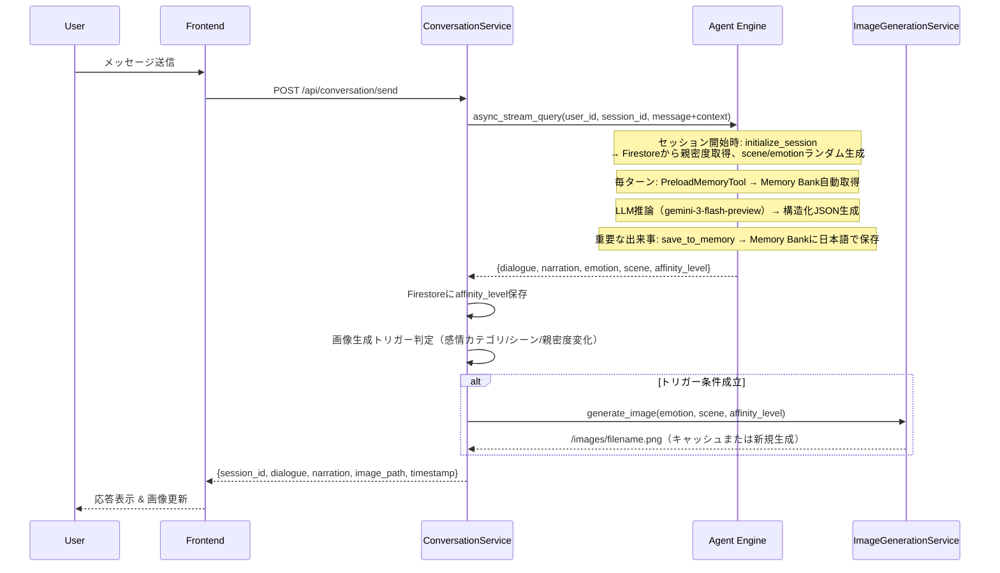
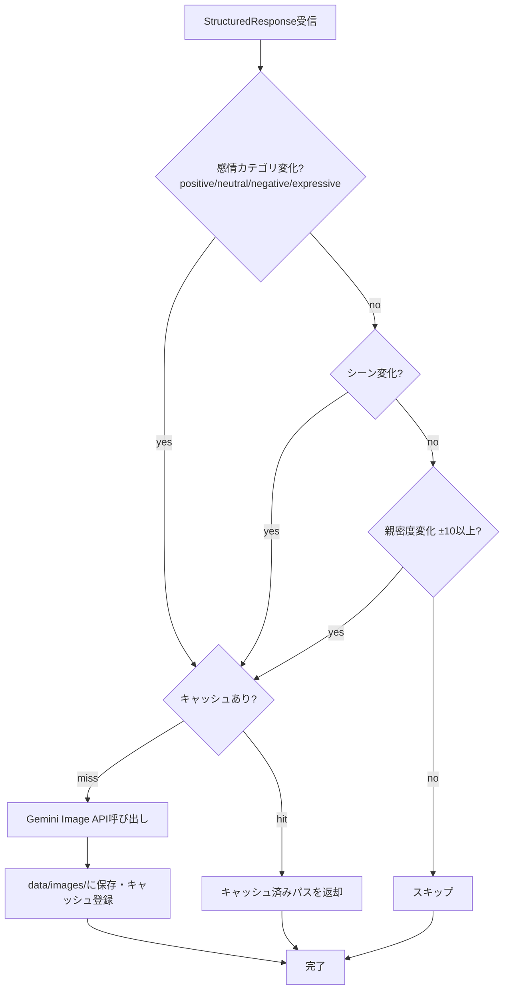
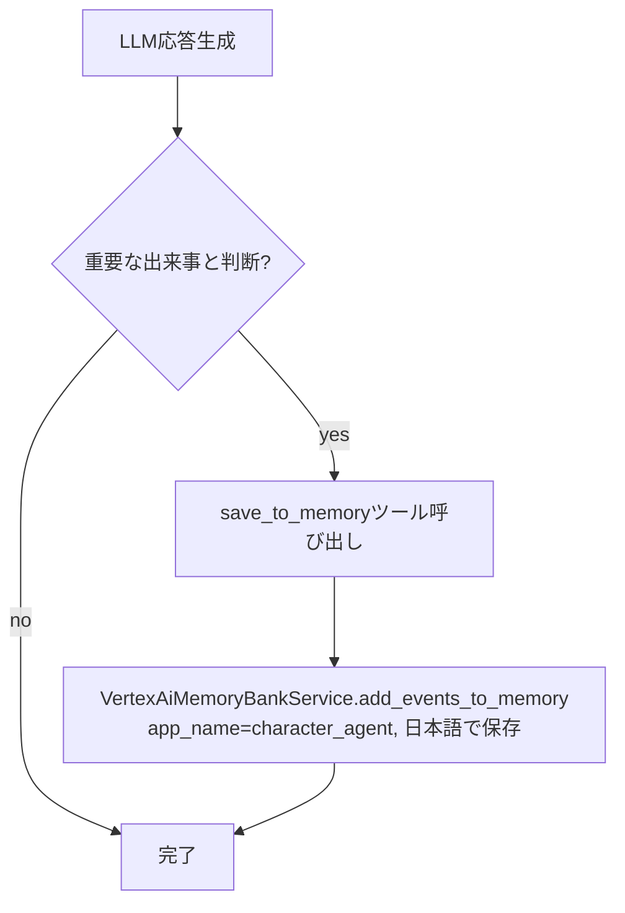

# 技術設計書

## 概要

Vertex AI Agent Engineを活用したステートフル対話アプリケーション。Memory Bank(長期記憶)とSessions(短期記憶)による二層記憶管理、感情・シーン変化に応じた画像動的生成、親密度システムを実現する。

**目的**: Google Cloud関連登壇での15分技術デモ

### ゴール

- Agent EngineのMemory BankとSessionsを活用した二層記憶管理の実装
- LLMからの構造化出力(JSON)によるメタデータ抽出パターンの実証
- 感情カテゴリ・シーン変化に応じた画像生成トリガーの実装

### 非ゴール

- 本番環境レベルのパフォーマンス最適化
- 包括的なエラーリトライロジック
- マルチユーザー対応（デモは単一ユーザー想定）
- リアルタイム通知（WebSocket/SSE）

---

## テクノロジースタック

| Layer | Technology | Role |
|-------|-----------|------|
| Frontend | Next.js 14+ (TypeScript) + Tailwind + shadcn/ui | UI/状態管理 |
| Backend | FastAPI 0.104+ (Python 3.11+) | APIエンドポイント |
| Agent | ADK + `gemini-3-flash-preview` (global endpoint) | LLM推論・記憶管理 |
| Image | `gemini-3-pro-image-preview` (global endpoint) | 画像生成 |
| State | Cloud Firestore `user_states/{user_id}` | 親密度の永続化 |
| Memory | Vertex AI Memory Bank | 長期記憶（好み・出来事） |
| Storage | `data/images/` → FastAPI `/images/` で配信 | 生成画像 |

---

## システムフロー

### 会話フロー



### 画像生成トリガー判定フロー



感情カテゴリ分類:
- `positive`: happy, excited
- `neutral`: neutral, thoughtful
- `negative`: sad, angry
- `expressive`: surprised, embarrassed

### Memory Bank更新フロー



---

## データコントラクト

### StructuredResponse（LLM内部スキーマ、フロントには返さない）

```python
class StructuredResponse(BaseModel):
    dialogue: str
    narration: str
    emotion: Emotion    # happy|sad|neutral|surprised|thoughtful|embarrassed|excited|angry
    scene: Scene        # indoor|outdoor|cafe|park|school|home
    affinity_level: int  # 0-100。LLMが会話内容に基づき計算
```

廃止済み: `needsImageUpdate`, `affinityChange`, `isImportantEvent`, `eventSummary`

### ConversationRequest / ConversationResponse（API境界）

```python
class ConversationRequest(BaseModel):
    user_id: str
    message: str          # max 2000文字
    session_id: Optional[str] = None

class ConversationResponse(BaseModel):
    session_id: str
    dialogue: str
    narration: str
    image_path: Optional[str] = None  # /images/{emotion}_{scene}_{timestamp}.png
    timestamp: str
```

---

## APIエンドポイント

| Method | Path | 説明 |
|--------|------|------|
| POST | `/api/conversation/send` | メッセージ送信→会話応答返却 |
| GET | `/api/conversation/history?session_id=&limit=` | 会話履歴取得 |
| GET | `/health` | ヘルスチェック（Agent Engine接続状態） |
| GET | `/images/{filename}` | 生成画像の静的ファイル配信 |

エラー: 422（バリデーション）、503（Agent Engine障害）

---

## 物理データモデル

### Cloud Firestore `user_states/{user_id}`

```json
{
  "affinity_level": "int(0-100)",
  "last_updated": "ISO 8601（セッション開始時に書き込み）"
}
```

- `affinity_level`: ConversationServiceがStructuredResponseの値を毎ターン書き込み
- `last_updated`: initialize_sessionツールがセッション開始時に書き込み。次回起動時の経過日数計算に使用

### data/images/

ファイル名: `{emotion}_{scene}_{YYYYMMDDHHMMSS}.png`
例: `happy_cafe_20260224010832.png`

サーバー再起動でインメモリキャッシュはリセット。ファイル自体は残る。

---

## カスタムツール（Agent Engine上で実行）

| ツール | タイミング | 処理 |
|--------|----------|------|
| `initialize_session` | セッション開始時 | Firestoreから親密度取得、last_updated書き込み、ランダムscene/emotion生成 |
| `save_to_memory` | LLMが重要と判断した時 | VertexAiMemoryBankService経由でMemory Bankに保存（**日本語で**） |

廃止: `update_affinity`（→ConversationServiceがFirestoreに直接書き込み）

---

## 主要な設計決定

| 決定 | 理由 |
|------|------|
| update_affinityツール廃止 | LLM往復が1回減りレスポンス速度改善（10-15s→7-10s） |
| 感情カテゴリで画像トリガー | 個別感情変化は過剰生成。カテゴリ変化のみで適切な頻度に |
| 画像インメモリキャッシュ | 同一emotion×sceneは再生成せずAPI呼び出しゼロ |
| globalエンドポイント | Gemini 3系モデルはus-central1では動作しない |
| save_to_memoryを日本語指定 | 英語メモリは日本語での想起精度が低下するため |
| Firestore書き込みをFastAPI側に移動 | Agent Engineのツール実行削減による速度改善 |
